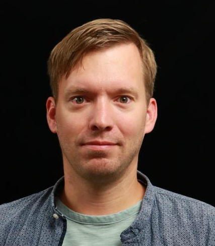
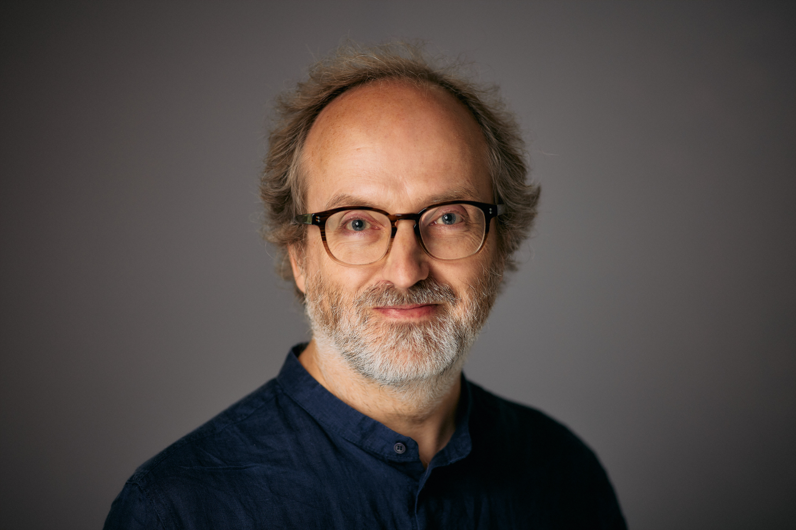
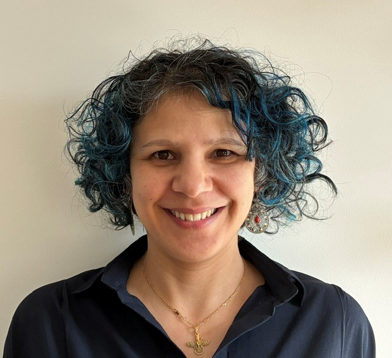

.. title:: Programme

.. only:: html

Programme
=========

Preliminary schedule
^^^^^^^^^^^^^^^^^^^^

Tuesday 21st July 2026

 ===================== ==========================
 Time                  Session
 ===================== ==========================
 10.30-11.00           Arrival 
 11.00-11.30           Welcome and project introduction: Chris Edsall (Cambridge)
 11.30-12.00           First invited talk – Christian Kniep (QNIB / MetaHub) 
 12.00-12.30           Second invited talk – Anil Madhavapeddy (Cambridge) 
 12.30-13.30           Lunch 
 13.30-14.20           Panel with audience questions 
 14.20-14.50           Third invited talk – Adam Huffman (Oxford/EESSI) 
 14.50-15.00           Break 
 15.00-15.30           Fourth invited talk – Fouzhan Houseni (Intel)  
 15.30-16.00           Fifth invited talk – Marc Dillon (AMD) 
 16.00-16.30           Sixth invited talk (TBC)
 16.30-16.45           Close and adjourn
 ===================== ==========================

Contributed talks
^^^^^^^^^^^^^^^^^

**Christian Kniep (QNIB/MetaHub): "Container Registry for AI"**

A registry used to be a simple blob-and-JSON mechanism for distributing container images. With ORAS artifacts, it can serve anything — which is exactly the problem. On HPC systems, application containers already carry code that must match the hardware and drivers beneath them. Add weights across quantizations, runtime configs, training workflows, kernels, skills, agent harnesses — and the question of what we federate becomes inseparable from who it serves: users, resource providers, software managers. Each pulls scope and governance in a different direction. Drawing on MetaHub, this keynote seeds one opinionated perspective to frame the discussion.

**Anil Madhavapeddy (University of Cambridge):  TBC**

   
**Adam Huffman (University of Oxford/EESSI): EasyBuild, EESSI, and HPC**

I will talk about how the experience of “building software with ease” has become more complicated over time as the EasyBuild community has grown, expectations have changed and external factors have radically altered.

**Fouzhan Hosseini (Intel): TBC**

**Marc Dillon (Principal Member of Technical Staff, AMD: TBC**

Marc is a lead platform engineer in the Silo AI Helsinki office of AMD. He works to make scalable solutions for AMD Enterprise customers, specializing in Kubernetes and cloud-native infrastructure with a passion for open-source. A seasoned technology leader with experience spanning engineering, consulting, and executive roles, Marc has delivered solutions for organizations around the world.
